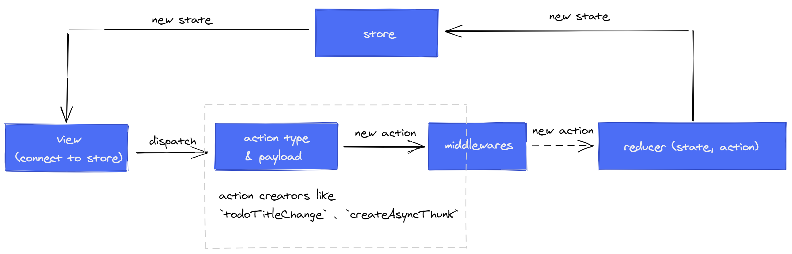

# react-seed脚手架说明
## 项目代码结构

## 关键代码结构介绍
展示的代码划分结构之中，有几个关键重要的代码层：
* 视图层view，对应目录view
* 数据模型层store，对应目录store
* 服务层service，对应目录service
* 中间件层middleware，对应目录mw

分层的逻辑逻辑如下图所示

view层往下划分了baseComponent、baseContainer、router、具体业务组件这几个层次，分别对应相关的文件夹，其中：
* baseComponent主要统一存放基础组件，基础组件包括第三方组件、基于第三方组件的定制组件，方便在baseComponent文件夹之中对组件接口统一定义，样式统一处理
* baseContainer主要存放通用的基础布局组件，统一布局处理
* router主要存放路由组件及基于基础路由组件的定制路由组件
* 其他业务组件主要存放业务相关的UI组件
  
store层也就是数据模型层，相关业务代码存放在store文件夹下，业务代码主要包括：
* 存放业务数据、业务组件状态
* 对接service层
* 定义action creator, action creator实现相关业务逻辑并发出action type，触发相关reducer更新数据和状态

service层主要处理数据接口调用及配置，代码主要存放在service文件夹下

middleware层可以针对某一类的action type执行某些全局逻辑，比如接口统一报错以后展示全局弹窗，统一打印应用业务日志 

## 构建打包配置说明
构建打包工具是webpack，相关配置文件在 *buildConfig* 目录之中。配置信息就存在于`webpack.dev.config.js`、`webpack.prod.config.js` 和 `base.config.js` 之中。其中：
* `base.config.js` 主要用于存放 `webpack.dev.config.js` 和 `webpack.prod.config.js`  的公共配置，只要修改了 `base.config.js` ，dev和prod的配置都会相应更新。上述两个文件的entry配置都在 `base.config.js` 之中，整个app的入口文件是 *`src/index.tsx`*
* `webpack.dev.config.js` 主要包含一些在development模式下的相关配置（比如webpack-dev-server的配置），由 `npm run dev`  这个命令启动，webpack-dev-server使用 *`src/index.html`* 作为主页面。
* `webpack.prod.config.js` 主要包含一些在production模式下的相关配置，由 `npm run build` 这个命令启动，并通过 `html-webpack-plugin` 读取 *`src/index.ejs`* 模板文件生成html文件作为主页面。

接下来是其他配置文件说明：
* `.babelrc` 的配置主要是用于在babel转译ES6和react时，指定所需要的preset和plugins，preset有 `@babel/preset-env`、`@babel/preset-react` 和 `@babel/preset-typescript`，plugins有 `react-hot-loader/babel` 、`babel-plugin-lodash` 、`babel-plugin-import` 和 `@babel/plugin-proposal-class-properties`。上述提到的preset和plugins的作用及其使用细节，大家可以去github了解，这里不再赘述。
* `tsconfig.json` 的配置详细说明可以参考[一](https://www.typescriptlang.org/v2/tsconfig/)、[二](https://code.visualstudio.com/docs/languages/jsconfig)、[三](https://github.com/microsoft/TypeScript-Babel-Starter#create-your-tsconfigjson) 三篇文章。项目中的tsconfig.json主要设置了项目中包含ts文件的范围( include 和 exclude 选项)，设置了简写路径( baseUrl 和 paths )，以便于vscode进行文件跳转，设置了 ES 模块标准和 commonjs 的模块在互相引入时，能通过编译（ esModuleInterop 和 allowSyntheticDefaultImports ），具体原因见[这里](https://www.typescriptlang.org/v2/tsconfig/#esModuleInterop)。
* `package.json` 主要配置了该app中的依赖包，并配置了不同模式的项目启动命令。其中development模式下，使用 `npm run dev`，production模式下使用 `npm run build` 。
## 编码约定
这里是编码约定介绍...未完待续

## reduxjs-toolkit：基于reduxjs的数据状态库介绍
[`reduxjs`](https://redux.js.org/introduction/getting-started)是一个数据状态管理库，它可以作为视图层组件的外置状态库，进行跨组件通讯。而redux toolkit则是集合了redux及其优秀开源中间件形成的一个基于redux的增强工具包，并且优化了为`reduxjs`编写`action creator`和`reducer`的编程体验。这些中间件包括[`immer`](https://github.com/immerjs/immer)，[`redux-thunk`](https://github.com/reduxjs/redux-thunk)。

> redux数据流

> 与redux-toolkit区别

按照redux-toolkit[官网](https://redux-toolkit.js.org/introduction/quick-start)的介绍，redux-toolkit提供了一个编写redux逻辑的标准方式，解决了一些redux存在的痛点：
* 复杂的redux配置
* 需要为redux添加许多第三方包才可以使用redux
* 编写redux逻辑会产生大量重复冗余代码
> react-redux的作用

## 使用typescript编写react组件

这里是参考了[文章一](https://github.com/piotrwitek/react-redux-typescript-guide#react---type-definitions-cheatsheet)，[文章二](https://github.com/typescript-cheatsheets/react-typescript-cheatsheet)之后的一些总结如下：
未完待续...

## 使用Lodash操作数据集

未完待续...

## Todo 
* 可以考虑slice之中的reducers map类型定义抽取出来，并在view层调用mapStateToProps的时候使用 (*optional*)
* 可以考虑响应的数据结构类型如何根据http接口文档定义生成 (*optional*)
* 集成storybook (*optional*)
* <del>配置eslint，并支持typescript类型校验 (*required*)</del>
* 配置redux middleware，实现全局提示框，实现在切换路由（path，query，hash）恢复默认某个state field (*required*)
* <del>编写普通redux reducer的处理过程，并在readme之中给出相应的说明 (*required*)</del>
* 完成todo detail的功能，detail update & todo update log (*required*)
* 添加postcss (*required*)
* <del>删除makeurl (*required*)</del>
* 添加可结构化配置的route, 设计可嵌套路由配置 参考 [`vue-router`](https://router.vuejs.org/zh/guide/essentials/nested-routes.html)